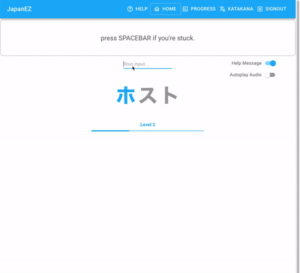
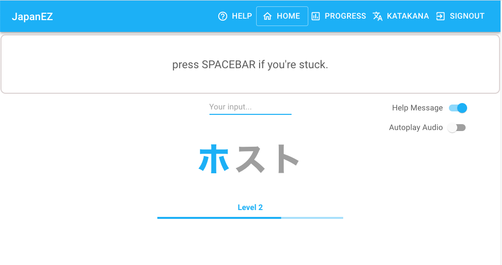
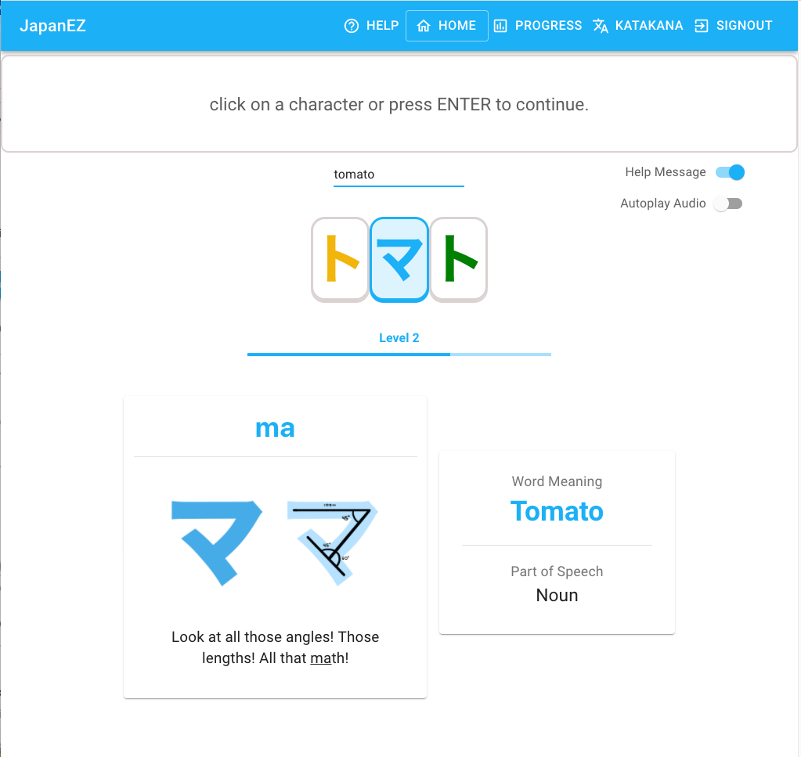

*Collaborator: Tuan Le*

# Japan EZ
Learn Japanese Katakana as you explore English-like Japanese words.

Live demo (click on "Guest Demo" to skip signing in): https://dieulien.github.io/JapanEZ/

        

        

        

This project was bootstrapped with [Create React App](https://github.com/facebook/create-react-app).

